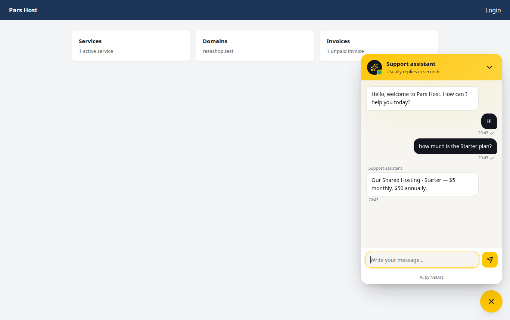
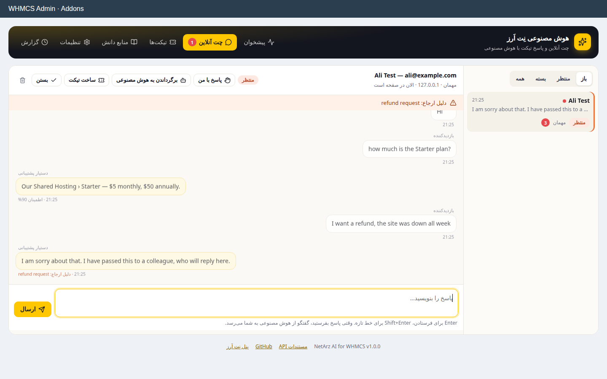

<div align="center">

# افزونهٔ هوش مصنوعی WHMCS نِت اَرز (NetArz AI for WHMCS)

**چت آنلاین و پاسخ تیکت با هوش مصنوعی، داخل WHMCS خودتان؛ با اعتبار هوش مصنوعی نِت اَرز.**

AI live chat and AI ticket replies for WHMCS, powered by the NetArz AI API (GPT, Claude, Gemini, DeepSeek). Your NetArz AI credit is shown right in the WHMCS admin.

[](LICENSE)
[](https://github.com/netarz/netarz-ai-whmcs/releases)
[](#requirements)
[](#requirements)
[](https://github.com/netarz/netarz-ai-whmcs/actions)
[](https://netarz.ir/docs/ai?utm_source=github&utm_medium=referral&utm_campaign=netarz-ai-whmcs&utm_content=header)

[دانلود آخرین نسخه](https://github.com/netarz/netarz-ai-whmcs/releases/latest) · [ساخت کلید API](https://netarz.ir/ai?utm_source=github&utm_medium=referral&utm_campaign=netarz-ai-whmcs&utm_content=header) · [وب‌سرویس هوش مصنوعی](https://netarz.ir/ai-api?utm_source=github&utm_medium=referral&utm_campaign=netarz-ai-whmcs&utm_content=header) · [English](#english)

 

</div>

<a id="intro"></a>

این افزونه به WHMCS یک **دستیار پشتیبانی** اضافه می‌کند که در ناحیهٔ کاربری با مشتری‌ها چت می‌کند، تیکت‌ها را می‌خواند و
پاسخ می‌نویسد، و هر جا لازم باشد کار را به همکاران شما می‌سپارد. جوابش را فقط از اطلاعات خود WHMCS شما می‌دهد: پایگاه
دانش، محصولات و قیمت‌ها، قیمت دامنه‌ها، اطلاعیه‌ها، اختلال‌های شبکه، یادداشت‌هایی که خودتان می‌نویسید، و برای مشتریِ واردشده
سرویس‌ها و فاکتورهای خودش.

مدل‌ها از [وب‌سرویس هوش مصنوعی نِت اَرز](https://netarz.ir/ai-api?utm_source=github&utm_medium=referral&utm_campaign=netarz-ai-whmcs&utm_content=intro) می‌آیند: یک کلید، مدل‌های GPT، Claude، Gemini و DeepSeek، و اعتباری که
به تومان می‌خرید. اعتبار باقی‌مانده را در پیشخوان WHMCS می‌بینید.

## فهرست

- [چه می‌کند](#features)
- [نصب در پنج قدم](#install)
- [حالت‌های تیکت](#ticket-modes)
- [دستیار از کجا جواب می‌دهد](#knowledge)
- [هزینه و کنترل آن](#cost)
- [امنیت و حریم خصوصی](#security)
- [پرسش‌های رایج](#faq)
- [آزمون‌ها](#tests)
- [English](#english)

<a id="features"></a>

## چه می‌کند

**چت آنلاین در ناحیهٔ کاربری**
- پنجرهٔ چت روی همهٔ صفحه‌های ناحیهٔ کاربری، فارسی و راست‌به‌چپ یا انگلیسی، با رنگ و جای دلخواه؛ روی گوشی تمام‌صفحه باز می‌شود.
- دستیار صبر می‌کند تا مشتری پیامش را تمام کند و به چند خطِ پشت‌سرهم یک جواب می‌دهد، نه سه جواب.
- نشانگر «در حال نوشتن»، تیک «دیده شد»، و گفتگویی که با بارگذاری دوبارهٔ صفحه از دست نمی‌رود.
- مهمان‌ها با نام و ایمیل، مشتری‌های واردشده بدون فرم. اگر مهمان وسط گفتگو وارد حسابش شود، گفتگو با او می‌ماند.
- وقتی کار به همکار شما نیاز دارد (بازگشت وجه، شکایت، کاری روی حساب)، گفتگو به صف همکاران می‌رود و اگر در زمانی که تعیین
  کرده‌اید کسی جواب نداد، به مشتری پیشنهاد می‌شود گفتگو را به تیکت تبدیل کند.

**صندوق چت برای همکاران شما**
- فهرست گفتگوهای باز، منتظر و بسته؛ متن کامل گفتگو و دلیل ارجاع.
- «پاسخ با من» گفتگو را از هوش مصنوعی می‌گیرد و «برگرداندن به هوش مصنوعی» پس می‌دهد. نوشتن پاسخ هم گفتگو را به شما می‌سپارد.
- پیام کوچکی در همهٔ صفحه‌های پنل مدیریت خبر می‌دهد که بازدیدکننده‌ای منتظر است.

**پاسخ تیکت**
- هر تیکت تازه و هر پاسخ مشتری، در دپارتمان‌هایی که انتخاب کرده‌اید، خوانده می‌شود.
- در صفحهٔ هر تیکت، پنل «پاسخ هوش مصنوعی» پیش‌نویس را نشان می‌دهد و با یک دکمه در کادر پاسخ WHMCS می‌گذارد.
- در حالت خودکار، فقط پاسخ‌هایی فرستاده می‌شوند که دستیار به آن‌ها مطمئن است؛ بقیه پیش‌نویس می‌مانند با یک یادداشت داخلی.
- بعد از پاسخ یکی از همکاران، دستیار روی همان تیکت کنار می‌کشد.

**اعتبار و هزینه**
- اعتبار هوش مصنوعی نِت اَرز (دلار و معادل تومانی) در پیشخوان افزونه و ابزارک صفحهٔ اصلی پنل مدیریت WHMCS.
- سقف هزینهٔ روزانه، حداقل اعتبار، و ایمیل به مدیران وقتی اعتبار کم می‌شود.
- گزارش هر درخواست با تعداد توکن، هزینهٔ تخمینی، مدت پاسخ و شناسه‌ای که با پنل نِت اَرز یکی است.

<a id="install"></a>

## نصب در پنج قدم

1. فایل `netarz-ai-whmcs-1.0.1.zip` را از [صفحهٔ نسخه‌ها (Releases)](https://github.com/netarz/netarz-ai-whmcs/releases/latest) دانلود کنید و پوشهٔ
   `modules/addons/netarz_ai` را در همان مسیرِ نصب WHMCS خودتان بارگذاری کنید.
2. در پنل مدیریت WHMCS به **System Settings ← Addon Modules** بروید، «NetArz AI» را فعال کنید و به نقش‌های مدیریتیِ لازم
   دسترسی بدهید.
3. در [پنل هوش مصنوعی نِت اَرز](https://netarz.ir/ai?utm_source=github&utm_medium=referral&utm_campaign=netarz-ai-whmcs&utm_content=install) یک کلید API بسازید (`sk-ntz-v1-…`) و اعتبار بخرید.
4. در **Addons ← NetArz AI ← تنظیمات** کلید را بگذارید، ذخیره کنید و «آزمایش اتصال» را بزنید.
5. پیشنهاد: یک مدیر با نام «دستیار پشتیبانی» بسازید و در بخش تیکت‌ها انتخابش کنید تا پاسخ‌ها به نام او ثبت شوند. کران (cron)
   WHMCS باید طبق معمول هر پنج دقیقه اجرا شود.

حالت تیکت پیش‌فرض «پیش‌نویس برای همکاران» است؛ یعنی تا خودتان حالت خودکار را روشن نکنید، هیچ پاسخی بدون دیدن همکاران
شما به مشتری نمی‌رسد. پیش از روشن کردن حالت خودکار، در زبانهٔ «دانش» بخش «آزمایش دستیار» را امتحان کنید.

<a id="requirements"></a>

**نیازمندی‌ها:** WHMCS 8.0 یا بالاتر، PHP 7.4 یا بالاتر با افزونه‌های curl، json و mbstring، و دسترسی سرور به `https://netarz.ir`.

<a id="ticket-modes"></a>

## حالت‌های تیکت

| حالت | چه اتفاقی می‌افتد |
|---|---|
| خاموش | دستیار تیکت‌ها را نمی‌خواند. پنل صفحهٔ تیکت هم نشان داده نمی‌شود. |
| پیش‌نویس برای همکاران (پیش‌فرض) | پاسخ در صفحهٔ تیکت آماده می‌شود؛ یکی از همکاران آن را می‌خواند، ویرایش می‌کند و می‌فرستد. |
| پاسخ خودکار | پاسخ‌هایی با اطمینانِ بالاتر از حدی که تعیین کرده‌اید فرستاده می‌شوند. شکایت، بازگشت وجه، کار روی حساب و هر چیزی که در دانش نیست، پیش‌نویس می‌ماند با یادداشت داخلی. |

در هر دو حالت فعال، برای هر تیکت می‌توانید «توقف روی این تیکت» را بزنید، یا «نوشتن دوباره» برای پیش‌نویس تازه.

<a id="knowledge"></a>

## دستیار از کجا جواب می‌دهد

دستیار برای هر پرسش، مرتبط‌ترین بخش‌های این منابع را برمی‌دارد و از جای دیگری جواب نمی‌دهد:

- **یادداشت‌های شما**: ساعت پاسخگویی، شرایط بازگشت وجه، نیم‌سرورها (Nameserver)، جواب پرسش‌های پرتکرار. این متن بر همه مقدم است.
- **پایگاه دانش** (فقط مقاله‌های عمومی) و **اطلاعیه‌های منتشرشده**.
- **محصولات و قیمت‌ها** از فرم سفارش، با لینک سفارش؛ محصولات پنهان و بازنشسته حساب نمی‌شوند.
- **قیمت دامنه‌ها**، فقط وقتی پرسش دربارهٔ دامنه است.
- **اختلال‌های باز شبکه** از صفحهٔ Network Status.
- **حساب مشتریِ واردشده**: سرویس‌ها، دامنه‌ها، فاکتورهای پرداخت‌نشده و اعتبار حساب؛ فقط برای خودِ همان مشتری.

پرسش فارسی مقالهٔ انگلیسی را هم پیدا می‌کند («نیم سرور» → nameserver، «گواهی» → SSL و…).

<a id="cost"></a>

## هزینه و کنترل آن

هزینه همان هزینهٔ وب‌سرویس هوش مصنوعی نِت اَرز برای مدلی است که انتخاب می‌کنید. با مدل پیش‌فرض `gpt-4o-mini`، هر پاسخ
چت یا تیکت معمولاً چند هزار توکن ورودی (بیشترش دانشِ همراه پرسش) و چند صد توکن خروجی است؛ قیمت روز هر مدل را در
[فهرست مدل‌ها](https://netarz.ir/ai-api/models?utm_source=github&utm_medium=referral&utm_campaign=netarz-ai-whmcs&utm_content=cost) می‌بینید.

- **سقف روزانه (دلار):** وقتی پر شود، دستیار تا فردا کنار می‌کشد و گفتگوها به همکاران شما می‌رسد.
- **حداقل اعتبار:** پیش از تمام شدن اعتبار، دستیار کنار می‌کشد و حداکثر روزی یک ایمیل به مدیران می‌رود.
- **محدودیت پیام هر بازدیدکننده در ساعت** و **بلندترین پاسخ (توکن)**.

عددی که افزونه نشان می‌دهد تخمینی است (توکن × قیمت عمومی مدل)؛ رقم دقیق در پنل نِت اَرز است.

<a id="security"></a>

## امنیت و حریم خصوصی

- کلید API رمزنگاری‌شده با `encrypt()` خود WHMCS ذخیره می‌شود و هرگز به مرورگر نمی‌رسد؛ در گزارش ماژول (Module Log) هم پوشانده می‌شود.
- از حساب مشتری فقط فهرست مشخصی از فیلدها خوانده می‌شود. رمز عبور، نام کاربری سرویس، IP سرور، فیلدهای سفارشی و یادداشت‌های
  داخلی هرگز به مدل داده نمی‌شوند.
- گفتگوی هر مشتریِ واردشده فقط برای خودش باز می‌شود؛ از توکنِ گفتگو فقط هش SHA-256 ذخیره می‌شود.
- درخواست‌های نوشتنی چت سرآیند اختصاصی می‌خواهند و مبدأ (Origin) بررسی می‌شود؛ فرم‌ها و درخواست‌های پنل مدیریت توکن CSRF دارند.
- هر متنی که مشتری یا مدل می‌نویسد به‌صورت متن نمایش داده می‌شود، نه HTML.
- اگر مشتری رمزش را در چت بنویسد، دستیار تکرارش نمی‌کند و از او می‌خواهد همان لحظه عوضش کند.
- نگه‌داری گفتگوها و گزارش‌ها محدود است (پیش‌فرض ۱۸۰ روز) و کران روزانه قدیمی‌ترها را پاک می‌کند.
- غیرفعال کردن افزونه داده‌ها را نگه می‌دارد؛ برای پاک کردن کامل، دکمهٔ «پاک کردن همهٔ داده‌های افزونه» در تنظیمات را بزنید.

<a id="faq"></a>

## پرسش‌های رایج

**بدون هوش مصنوعی هم کار می‌کند؟** بله. اگر «پاسخ هوش مصنوعی در چت» را خاموش کنید، چت آنلاین مثل یک چت معمولی کار
می‌کند و همکاران شما از صندوق چت جواب می‌دهند.

**اگر اعتبار تمام شود؟** دستیار کنار می‌کشد: چت‌ها به صف همکاران می‌روند و تیکت‌ها بدون پاسخ خودکار می‌مانند.

**مدل را می‌توانم عوض کنم؟** هر مدل گفتگوی کاتالوگ نِت اَرز را می‌توانید انتخاب کنید؛ فهرست و قیمت‌ها در تنظیمات افزونه
بارگذاری می‌شوند.

**قالب ناحیهٔ کاربری من سفارشی است؛ چت کار می‌کند؟** چت از هوک `ClientAreaFooterOutput` بارگذاری می‌شود و به قالب وابسته
نیست. اگر در صفحه‌ای نمی‌خواهید دیده شود، مسیرش را در «پنهان کردن چت در این صفحه‌ها» بنویسید.

**لینک مستقیم برای شروع گفتگو دارم؟** `index.php?m=netarz_ai` ناحیهٔ کاربری را با پنجرهٔ چتِ باز نشان می‌دهد. از جاوااسکریپت
هم `NetArzChat.open()` کار می‌کند.

<a id="tests"></a>

## آزمون‌ها

```bash
composer install
composer test            # 141 آزمون واحد و یکپارچگی روی یک WHMCS شبیه‌سازی‌شده (SQLite)
composer test:live       # بررسی اتصال به API واقعی نِت اَرز (با NETARZ_API_KEY، یک درخواست پولی بسیار کوچک هم)
node tests/e2e/run.cjs   # ۵۰ بررسی در مرورگر واقعی: ویجت، صندوق چت، پنل تیکت، تنظیمات، موبایل فارسی
EVAL_API_KEY=sk-ntz-v1-… php tests/eval/run.php   # ۱۵ سناریوی واقعی مشتری با مدل واقعی
```

WHMCS نرم‌افزار تجاری است و در این مخزن نیست. آزمون‌ها کد واقعی افزونه را روی لایهٔ پایگاه دادهٔ خود WHMCS
(Illuminate Capsule)، جدول‌های WHMCS و `localAPI`ای اجرا می‌کنند که همان هوک‌های WHMCS را صدا می‌زند.

## مخزن‌های دیگر نِت اَرز

- [نمونه‌کد وب‌سرویس هوش مصنوعی](https://github.com/netarz/ai-api-examples): Python، Node.js، PHP، Laravel، cURL، LangChain، n8n و ربات تلگرام.
- [نمونه‌کد API نرخ ارز](https://github.com/netarz/fx-api-examples) و [افزونهٔ وردپرس نرخ ارز](https://github.com/netarz/netarz-fx-wordpress).

<a id="support"></a>

## مشارکت و پشتیبانی

- **اشکال در افزونه:** یک [Issue](https://github.com/netarz/netarz-ai-whmcs/issues/new/choose) باز کنید و نسخهٔ WHMCS و PHP و نتیجهٔ «آزمایش اتصال» را هم بنویسید.
- **رفع اشکال، ترجمه یا امکان تازه:** Pull Request بفرستید. پیش از آن [راهنمای مشارکت](CONTRIBUTING.md) را ببینید.
- **حساب، کلید و اعتبار:** از پنل نِت اَرز تیکت بزنید یا به `info@netarz.ir` ایمیل بفرستید.
- **مشکل امنیتی:** در Issue عمومی ننویسید؛ طبق [سیاست امنیتی](SECURITY.md) به `dev@netarz.ir` بفرستید.

مجوز: MIT ([LICENSE](LICENSE)) · [آیین رفتار](CODE_OF_CONDUCT.md)

---

<a id="english"></a>

## English

**NetArz AI for WHMCS** adds an AI support assistant to WHMCS. It chats with visitors in the client area, reads and answers
support tickets, and hands over to your staff whenever a person is needed. It answers only from your own WHMCS: the public
knowledgebase, products and prices, domain prices, announcements, open network issues, the notes you write, and — for a
signed-in client — that client's own services, domains and unpaid invoices.

It runs on the [NetArz AI API](https://netarz.ir/ai-api?utm_source=github&utm_medium=referral&utm_campaign=netarz-ai-whmcs&utm_content=english)
(OpenAI-compatible: GPT, Claude, Gemini, DeepSeek with one key) and shows your remaining NetArz AI credit on the WHMCS dashboard.

### Features

- **Live chat widget** on every client-area page: English or Persian (RTL), custom colour and position, full-screen on phones,
  typing indicator, seen ticks, conversation kept across page loads. Messages typed in a burst get one answer.
- **Handover to staff** for refunds, complaints, account changes or anything outside the knowledge. If nobody answers in time,
  the visitor is offered to turn the chat into a ticket.
- **Staff inbox** with take-over / hand-back, the full transcript, the handover reason and an alert on every admin page.
- **Ticket replies** in three modes: off, drafts for staff (default), or automatic for confident answers only. A panel on each
  ticket page shows the draft and drops it into the WHMCS reply box. The AI steps back once staff reply.
- **Credit and spend**: balance on the dashboard widget, daily spending cap, minimum balance, low-credit email, and a request log
  whose IDs match your NetArz panel.

### Install

1. Download `netarz-ai-whmcs-1.0.1.zip` from [Releases](https://github.com/netarz/netarz-ai-whmcs/releases/latest) and upload
   `modules/addons/netarz_ai` into your WHMCS installation.
2. **System Settings → Addon Modules**: activate *NetArz AI* and grant access to the admin roles that need it.
3. Create an API key (`sk-ntz-v1-…`) in the [NetArz AI panel](https://netarz.ir/ai?utm_source=github&utm_medium=referral&utm_campaign=netarz-ai-whmcs&utm_content=english) and add credit.
4. **Addons → NetArz AI → Settings**: paste the key, save, then *Test connection*.
5. Recommended: create an admin user called "Support assistant" and choose it under Tickets so AI replies carry that name.
   Keep the WHMCS cron running every five minutes.

Requirements: WHMCS 8.0+, PHP 7.4+ with curl, json and mbstring, outbound HTTPS to `netarz.ir`.

The ticket mode starts as **drafts for staff**: nothing reaches a customer unseen until you switch automatic mode on. Try the
*Test the assistant* console under Knowledge first.

### Security and privacy

- The API key is stored with WHMCS's own `encrypt()`, never sent to the browser, and masked in the module log.
- Only a fixed list of client fields is read. Passwords, service usernames, server IPs, custom fields and admin notes never
  reach the model.
- A signed-in client's conversation opens for that client only; only a SHA-256 of the visitor token is stored.
- Chat writes require a custom header and a same-origin check; admin forms and AJAX calls carry a CSRF token.
- Everything a visitor or the model writes is rendered as text, never HTML.
- If a customer types a password into the chat, the assistant never repeats it and tells them to change it.
- Conversations and logs are pruned after the retention period (default 180 days). Deactivating keeps your data;
  *Remove all module data* in Settings deletes it.

### Tests

`composer test` runs 141 unit and integration tests against a WHMCS stand-in (WHMCS's own Illuminate Capsule on SQLite, the
WHMCS tables the module reads, and a `localAPI` that fires the same hooks WHMCS fires). `node tests/e2e/run.cjs` drives the widget,
the staff inbox, the ticket panel and the settings in headless Chrome (50 checks). `tests/eval/run.php` runs 15 real customer
scenarios against a real model. WHMCS itself is commercial software and is not part of this repository.

### License

[MIT](LICENSE). Lucide icons are inlined under the ISC licence.
